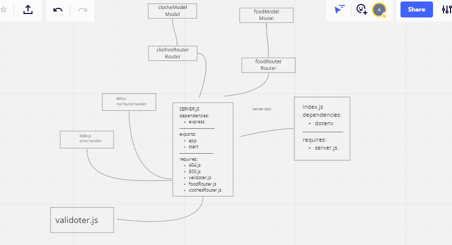

# basic-api-server1

## basic-express-server
Heroku app link: [https://basic-api-server1-amro.herokuapp.com/](https://basic-api-server1-amro.herokuapp.com/)
**the link of heroku dose not work

GitHub actions link: [https://github.com/amroalbarham/basic-api-server1/actions](https://github.com/amroalbarham/basic-api-server1/actions)

Pull Rrequest link: [https://github.com/amroalbarham/basic-api-server1/pull/4](https://github.com/amroalbarham/basic-api-server1/pull/4)

description
a basic express server that has a get request an tests that requst along with some middleware. it integrated CI testing and Unit testing.

UML

